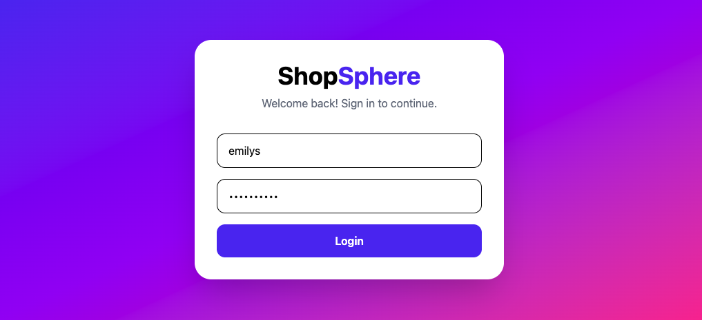
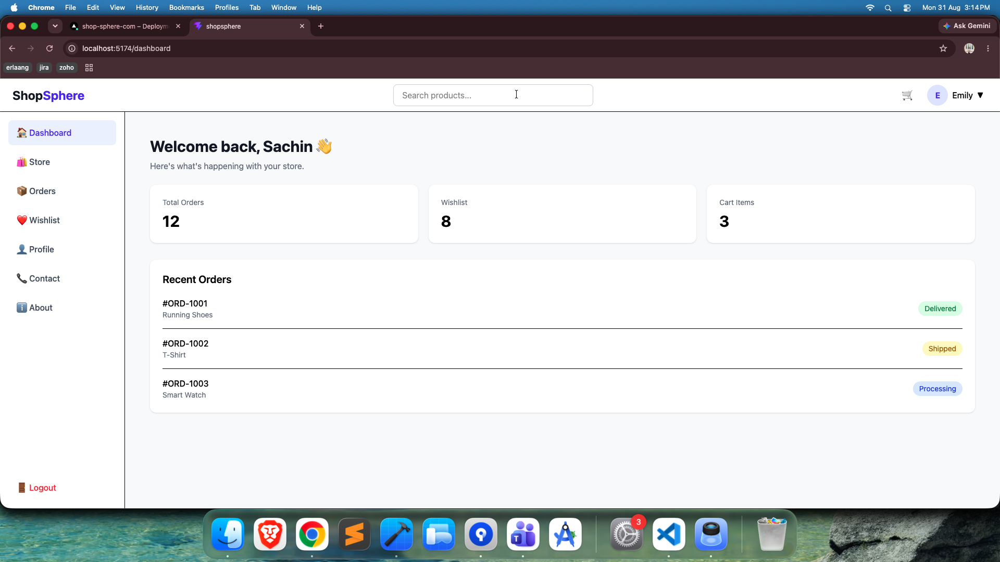
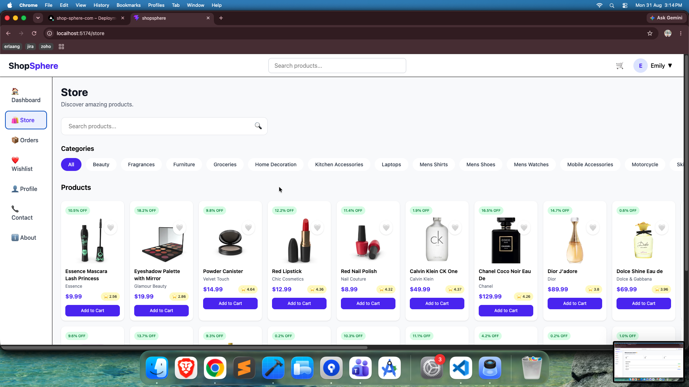
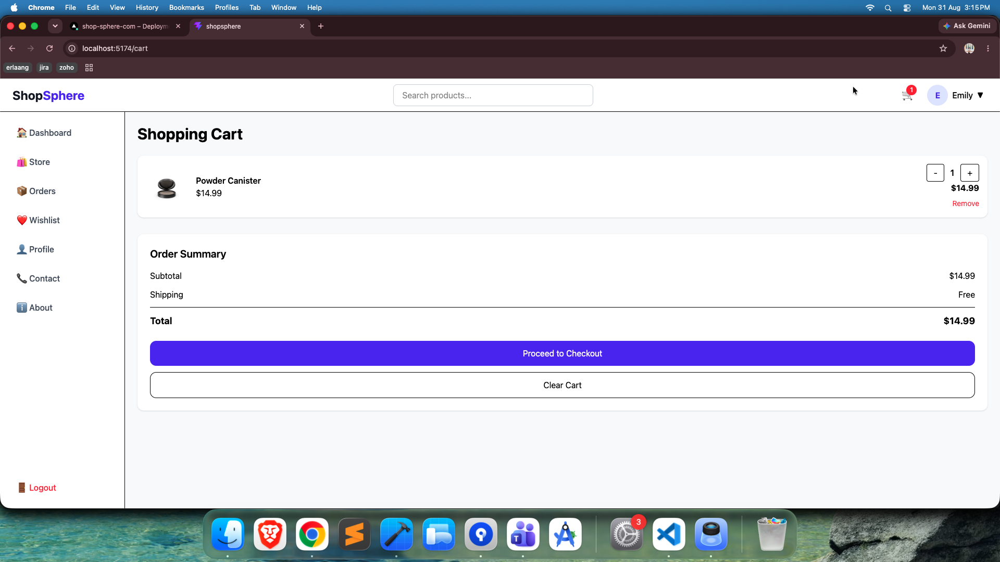
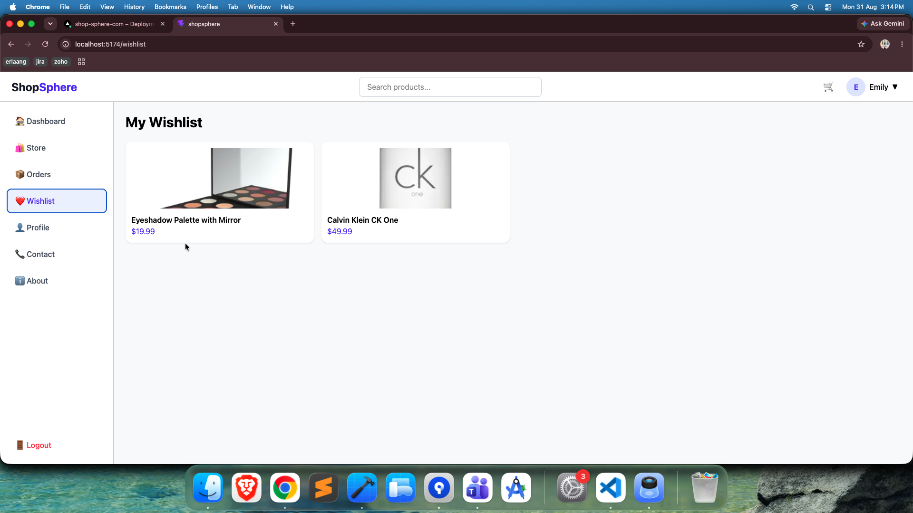
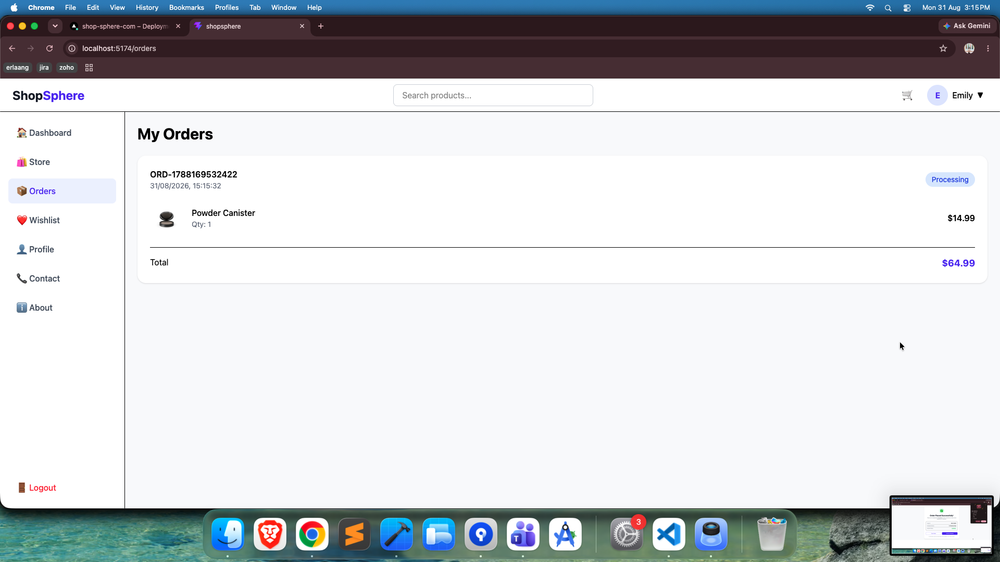
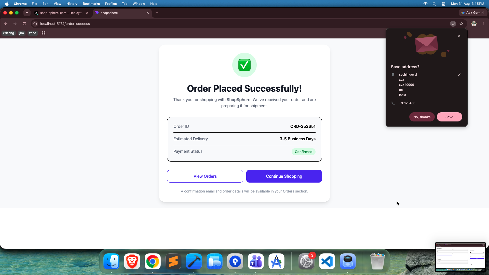
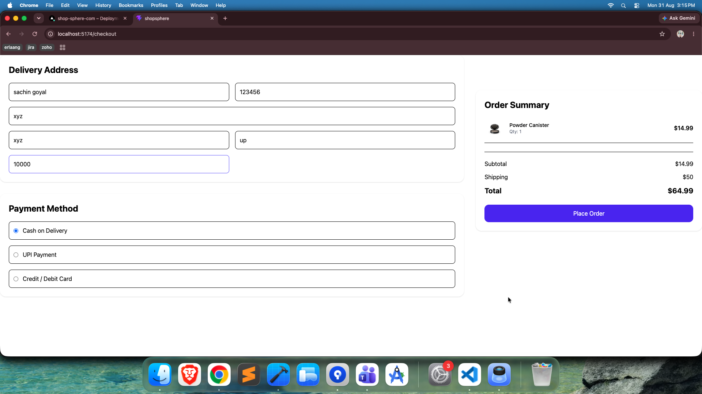

# 🛍️ ShopSphere

A modern e-commerce web application built with **React, Vite, Redux Toolkit, RTK Query, and Tailwind CSS**. The project includes authentication, product browsing, search functionality, category filtering, protected routes, and a responsive UI.

## 🚀 Live Demo

🔗 https://shop-sphere-com-git-main-sachingoyal.vercel.app

## 📸 Preview

<h3>Login</h3>


<h3>Dashboard</h3>


<h3>Store</h3>


<h3>Cart</h3>


<h3>WishList</h3>


<h3>Order</h3>


<h3>OrderPlaced</h3>


<h3>CheckOut</h3>


---
## ✨ Features

- 🔐 User Login Authentication
- 🛒 Product Store with Categories
- 🔍 Product Search
- 📱 Fully Responsive Design
- 🎨 Tailwind CSS UI
- ⚡ Fast performance with Vite
- 🔄 RTK Query API Integration
- 🛡️ Protected Routes
- 📩 Contact section with WhatsApp integration
- ☁️ Deployed on Vercel

---

## 🛠️ Tech Stack

| Technology | Purpose |
|------------|---------|
| React | Frontend |
| Vite | Build Tool |
| Redux Toolkit | State Management |
| RTK Query | API Fetching |
| React Router DOM | Routing |
| Tailwind CSS | Styling |
| JavaScript | Programming Language |
| Vercel | Deployment |

---

## 📂 Project Structure

```text
src/
├── assets/
├── components/
├── features/
│   ├── api/
│   └── auth/
├── pages/
├── routes/
├── App.jsx
└── main.jsx